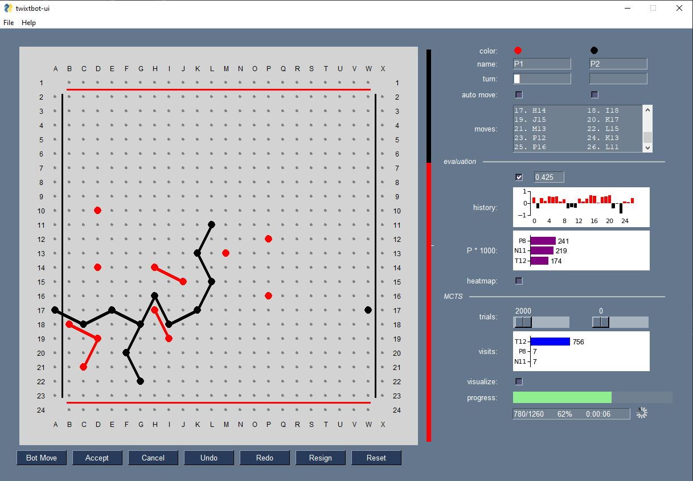
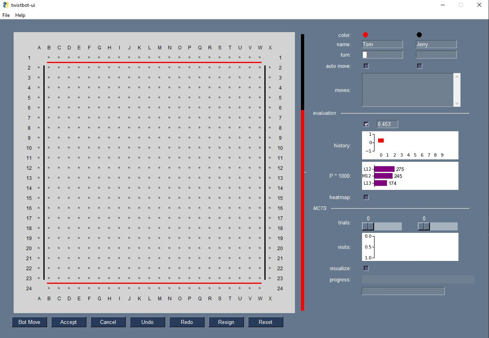
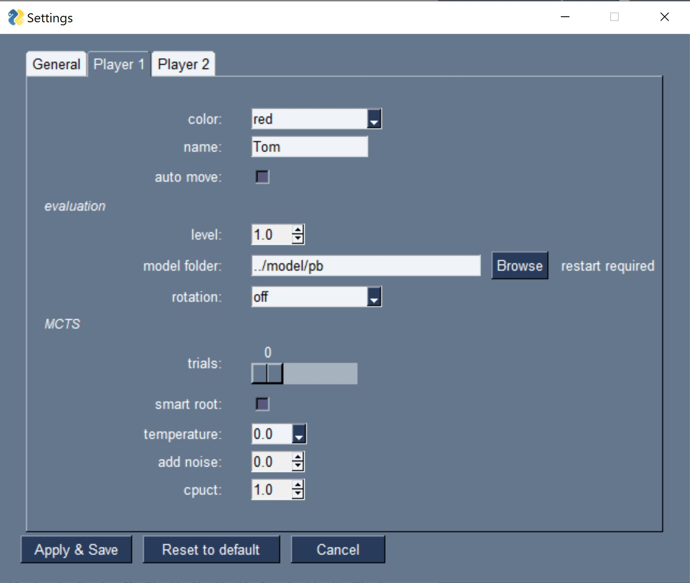

# twixtbot-ui

twixtbot-ui is a graphical user interface on top of [twixtbot](https://github.com/BonyJordan/twixtbot). twixtbot is an engine for the game of [TwixT](https://en.wikipedia.org/wiki/TwixT)
developed by Jordan Lampe. It uses [AlphaZero](https://en.wikipedia.org/wiki/AlphaZero) techniques, i.e. a neural network plus Monte-Carlo-Tree-Search and plays extremely strong. See its ratings at [littlegolem.net](https://littlegolem.net/jsp/games/gamedetail.jsp?gtid=twixt). It's brilliant! Big round of applause to Jordan!

twixtbot-ui brings twixtbot to your desktop in a simple standalone python program. You can play against the bot, have it evaluate past games or have two bots play against each other using different settings.

twixtbot-ui comes with all the neccessary twixtbot files in subfolder `./backend` so there is no dependency to the twixtbot repository. 



## Get started

clone or download this repository and make sure you have Python3 installed including pip. At the command line, change to the twixtbot-ui directory and install the necessary modules:

```
python -m pip install -r requirements.txt
```

Change to directory `./src` and start twixtbot-ui:

```
python tbui.py
```

Ignore the tensorflow warnings and confirm the pop-up message that says that a settings file will be created. Wait a few seconds until the bots have been initialized. You should see the GUI with a clean TwixT board and the control bar on the right:





## Play TwixT

### Human move

Place pegs by clicking on the board. You are in control of player1 and player2 at any time. Pegs are linked automatically. Change the settings *allow swap* and *allow scl* (*File -> Settings...*) to enable or disable the swap rule or self-crossing links, resp. Link removal is not supported.

### Bot move

There is one dedicated bot for each player. The bots can have different settings. Click button *Bot Move* to let the reponsible bot do the next move. If you switch on *auto move* the bot will make its moves automatically.

### Network

By default, both bots share the same neural network in folder `./model/pb`. The network has been taken from [twixtbot](https://github.com/BonyJordan/twixtbot) in Dec 2020. Some manual adjustments were necessary for tensorflow2 to read it. If you want to use another network that you have trained using twixtbot, have a look at the files in folder `./convert` to see what needs to be adjusted before twixtbot-ui can use it. Put the network into a separate folder and configure the folder in *File -> Settings...*.  

Note that the network was trained with self-crossing links allowed, which can lead to incorrect evaluations in certain cases, if *allow scl* is set to false (default). It doesn't make a big difference though in most cases.

### Evaluation

Before each move, the bot evaluates the board. The value head of the network returns a value in range [-1.0..1.0] that indicates the probability for a win of player1 and player2, resp. The policy head returns a value in range [0..1] for each legal move. A bar chart shows the top three moves. Parameter *temperature* [0, 0.5, 1.0] influences the policy, i.e. which move is picked. If *temperature* = 0 (default) the move with the highest value will be chosen.

### MCTS

The network is strong enough to win agaist almost any human player. However, if you want the bot to play even stronger you can switch on Monte-Carlo-Tree-Search. To do so chose a number of *trials* > 0. The more trials, the bigger the tree, i.e. the more boards will be evaluated. twixtbot-ui starts MCTS in a separate thread. Progress info is updated every 20 trials. The top three moves with the most visits are listed. If *smart accept* is switched on, the max number of trials will be reduced automatically depending on the visit difference between the leading move and the second best.  

In many cases MCTS will not lead to a different move than initially suggested by the network. Click *Accept* to accept the current best move. Click *Cancel* to abort; this will also set *auto move* to false. 
 
Note that for the first move and the swap move the bot does not use MCTS.

### Swap rule 

human players *swap* by clicking on the first peg. The peg will be replaced by a black peg, mirrored at the diagonal. twixtbot has its own swap policy (see `./backend/swapmodel.py`). It will swap any first move on row 7 to 18 plus moves B6, C6, V6, W6, B19, C19, V19, W19.

### Undo, Resign, Reset

Click these buttons to undo the last move, resign a game or start a new game, resp. You cannot click these buttons during MCTS. You cannot undo a move if the game is over. 

### File | Settings...



All settings can be changed and saved in *File -> Settings...*. Most changes are effective immediately and can be applied in the middle of a game. Click button *Reset to default* to reset the values in all three tabs. 

Parameters *auto move* and *trials* can also be changed in the control panel of the main window. These changes won't be saved when you exit the program. In the main window, to see the current settings in a tooltip, hover the mouse over the *auto move* checkboxes. 

#### Tab *General*

+ *allow swap*: switch on the swap rule (default: true)
+ *allow self crossing links*:  paper-and-pencil variant of TwixT (default: false), 
+ *board size*: number of pixels of a side of the board (default: 600)
+ *show labels*: display labels for rows and columns (default: true)
+ *show guidelines*: display lines that lead into the corners (default: false)
+ *smart accept*: during MCTS, reduce the max number of trials automatically according to the lead of the best move (default: true)

#### Tab *Player 1 / 2*

- *color*:  choose you favorite colors for the players (default: red / black)
- *name*: chose your favorite player names (default: Tom / Jerry)
- *auto move*: if true, the bot makes a move autmatically (default: false)
- *random rotation*: if true, the bot randomly chooses one of the four equivalent boards (rotation / mirroring) for evaluation (default: false)
- *model folder*: no reason to change this unless you have a second network (default: `../model/pb`)
- *trials*: number of MCTS iterations. Set it to 0 to switch off MCTS (default: 0)
- *temperature*: controls the policy which move is taken after MCTS: 
  - 0.0: choose move with highest number of visits; random choice for tie-break (default)
  - 0.5: random choice using probability distribution of squared number of visits
  - 1.0: random choice using probability distribution of number of visits   
- *add noise*: add dirichlet noise to P using alpha = 0.03:<br>
    P<sub>i<sub>new</sub></sub> := (1 - add_noise) * P<sub>i</sub> + add_noise * Dir(0.03)<br>
    default: add_noise = 0, so P remains unchanged
- *cpuct*: MCTS constant that balances exploitation vs. exploration (default: 1.0)<br>When selecting a branch down the tree, MCTS visits the node with the highest Upper Confidence Bound (UCB):<br>
U<sub>i</sub> := Q<sub>i</sub> + c<sub>puct</sub> * P<sub>i</sub> * sqrt(n + 1) / (n<sub>i</sub>+1)<br>
where Q<sub>i</sub> is initially 0 and updated after each visit depending on the score of the subtree:<br>
Q<sub>i<sub>new</sub></sub> := Q<sub>i</sub> + (score<sub>sub</sub> - Q<sub>i</sub>) / n<sub>i</sub><br>
Decrease c<sub>puct</sub> to move the needle towards exploitation, i.e reduce the influence of P

[This site](https://medium.com/oracledevs/lessons-from-alphazero-part-3-parameter-tweaking-4dceb78ed1e5) has more details on temperature, dirichlet noise and cpuct.

### File | Open File...

You can load games stored in [T1j](http://www.johannes-schwagereit.de/twixt/T1j/index.html) file format (*.T1). After the game is loaded and displayed, you can continue to play as usual or undo (but not redo) moves. twixtbot-ui only reads the move history and the player names, i.e. all other settings like *starting player* and *pierule?* are ignored. Each game is cosidered "unswapped" with player 1 to start.

You can also prepare files in an editor: The first 13 lines need to be comments except lines 4 and 5 for the player names. Append one line per move in upper or lower case with *swap* and *resign* being valid moves. See sample files in folder `./games`. Note that these files cannot be read by T1j.

```
#
# 
# 
Tom # player 1
Jerry # player 2
# 
# 
# 
# 
# 
# 
# 
# 
e15
swap
f17
H18
P12
resign
```
 
### Planned enhancements...

+ Load littlegolem game files (*.tsgf)
+ Save games 
+ Show evaluation history plot
+ draw current best MCTS move on board (dotted)
+ best moves heatmap


